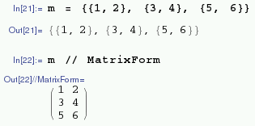
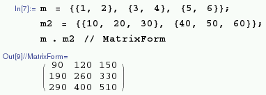

## Matrices

One of the most useful additional components of a mathematical programming language is the ability to do [matrix](https://en.wikipedia.org/wiki/Matrix_(mathematics) ) operations. Of course, Mathematica has these available.

To create a matrix first enter the values as a list of lists, making sure the dimensions are rectangular, i.e. `n x m` where `n` and `m` are integers:

```
m = {{1, 2}, {3, 4}, {5, 6}};
```

You can view this list as a matrix by typing:

```
m // MatrixForm
```



You can perform matrix operations such as [dot product](https://en.wikipedia.org/wiki/Dot_product):

```
m = {{1, 2}, {3, 4}, {5, 6}};
m2 = {{10, 20, 30}, {40, 50, 60}};
m . m2 // MatrixForm
```



