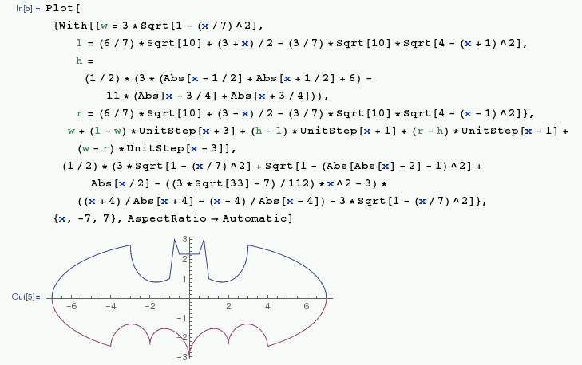

## Plotting

You can plot interesting things using Mathematica:



For example, plot an [echidnahedron](http://mathworld.wolfram.com/Echidnahedron.html) with the following command:

```
Graphics3D[{Opacity[.8], Glow[RGBColor[1,0,0]], EdgeForm[White], Lighting -> None, PolyhedronData["Echidnahedron", "Faces"]}]
```


