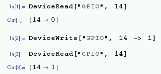

## GPIO

You can access the GPIO pins from Mathematica using the `DeviceWrite` and `DeviceRead` functions.

To access the GPIO pins you'll need to be running as root. To do this, run `sudo wolfram` from the terminal (this will run the command line `wolfram` environment), or `sudo mathematica &` to run the Mathematica notebook as root.

The following command turns on GPIO pin 14 (using BCM pin numbering):

```
DeviceWrite["GPIO", 14 -> 1]
```

The following command turns pin 14 off:

```
DeviceWrite["GPIO", 14 -> 0]
```

You can also read the status of a GPIO input device (to check if a button is pressed, for example) with `DeviceRead`, in a similar way:

```
button = DeviceRead["GPIO", 14]
```

The variable `button` should now contain `0` for off or `1` for on.



Read more about GPIO in general on the [GPIO usage page](https://www.raspberrypi.org/documentation/usage/gpio-plus-and-raspi2/README.md).

