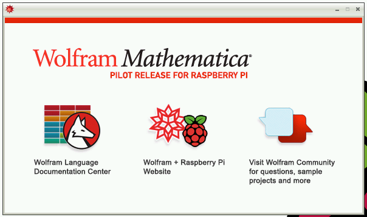
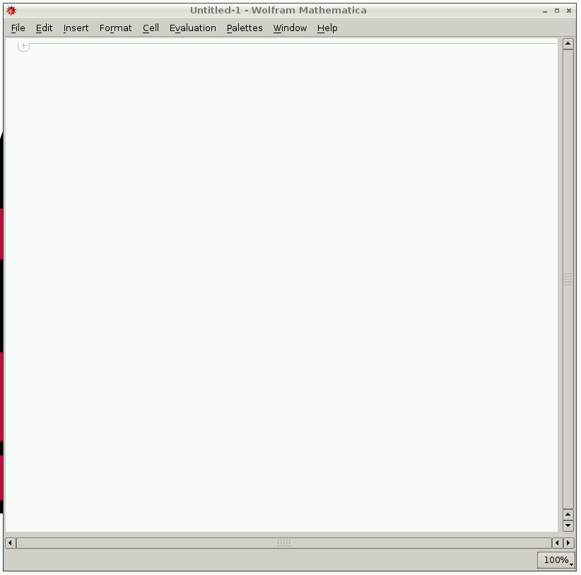

## Starting Mathematica

Double-click the `Mathematica` icon on the Desktop or open it from the applications menu to start. You'll see a splash screen with the red Mathematica logo while the program loads:

Once loaded, you'll see two windows. These are the Wolfram information dialogue:

and the Mathematica notebook:

The Wolfram information dialogue shows web links to:

- [Wolfram Language Documentation Center](http://reference.wolfram.com/language/index.html)
- [Wolfram + Raspberry Pi Website](http://www.wolfram.com/raspberry-pi)
- [Wolfram Community](http://community.wolfram.com/content?curTag=raspberry%20pi)

These links will open in the web browser on the Raspberry Pi, provided you're connected to the internet.

