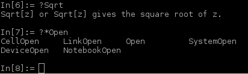
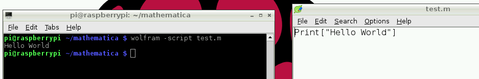

## Wolfram command line access

You can also access the Wolfram language from the command line by entering `wolfram` in the terminal, or double-clicking the Wolfram Desktop icon. This will give a text-only (non-graphical) programming environment with the `In[x]` / `Out[x]` style interface, but without interactive notebook functionality. The Mathematica functions will still work as expected:



You'll find the command line interface faster to use due to the lack of graphical processing required to run the notebook, however it lacks the graphical interface's interactivity and pretty printing.

To exit, press `Ctrl + D`.

### Running scripts with Wolfram

You can write a program, save it as a normal file (usually with a `.m` or `.wl` file extension), and execute the script from the command line by adding the `-script` flag.

To run `test.m`:

```bash
wolfram -script test.m
```



